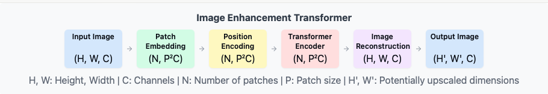

# imhance: Image Enhancement Transformer

<p></p>
This project implements a Transformer-based model for image enhancement from low resolution to high resolution. The entire transformer architecture has been implemented from scratch, providing deep understanding and full control over the model's behavior.

## Project Overview

The Image Enhancement Transformer uses attention mechanisms and transformer architecture to process and enhance images. The model takes low-resolution images as input and produces higher quality, enhanced versions as output.

### Key Features

- **Custom Transformer Architecture**: Fully implemented from scratch, using only basic torch functionality, allowing for deep understanding and customization.
- **Patch-based Processing**: Divides images into patches for efficient processing.
- **Flexible Input/Output Sizes**: Can handle various image dimensions and upscaling factors.
- **PyTorch Implementation**: Built using PyTorch for efficient GPU acceleration and ease of use.

## High-Level Transformer Logic

At its core, the Image Enhancement Transformer follows these main steps:

1. **Patch Embedding**: Convert the input image into a sequence of patch embeddings.
2. **Position Encoding**: Add positional information to the patch embeddings.
3. **Transformer Encoding**: Process the embedded patches through multiple layers of self-attention and feed-forward networks.
4. **Image Reconstruction**: Transform the processed features back into an enhanced image.

Here's a high-level view of the forward pass:

```python
def forward(self, image):
    # 1. Convert image to patch embeddings

    # 2. Add positional encodings

    # 3. Process through transformer layers

    # 4. Reconstruct and enhance the image

    return #enhanced_image
```

### Patch Embedding and Positional Encoding

The first step is to convert the input image into a sequence of patch embeddings:

```python
    def forward(self, batch_imgs: torch.Tensor):
        assert batch_imgs.dim() == 4, "Expecting batch of images with the shape (BATCH, CHANNEL, HEIGHT, WIDTH)"
        in_batch_size, in_chn, in_h, in_w = batch_imgs.shape
        assert (in_h == self.effective_h and in_w == self.effective_w), f"Input image shape must be ({self.effective_h}, {self.effective_w}) but given ({in_h,in_w})"

        # Apply patch embedding
        patch_embedded_image = self.patch_embed(batch_imgs)  # shape: (batch_size, embed_dim, height/patch_size, width/patch_size)

        # Reshape to sequence of patches
        patch_sequence_image = patch_embedded_image.flatten(2).transpose(1, 2)
        # shape: (batch_size, num_patches, embed_dim)
        # flatten(2) combines the two last dimensions of patch_embedded_image, returning shape: (batch_size, embed_dim, num_patches)
        # transpose switches the last and the middle axes, resulting in shape: (batch_size, num_patches, embed_dim)

        # Add positional embedding
        patch_sequence_image += self.pos_embed

        return patch_sequence_image
```

This process divides the image into patches and projects each patch into a higher-dimensional embedding space.

### Multi-Head Attention

The core of the transformer is the multi-head attention mechanism:

```python
class MultiHeadAttention(nn.Module):
    def __init__(self, embed_dim, num_heads):
        super().__init__()
        self.embed_dim = embed_dim
        self.num_heads = num_heads
        self.head_dim = embed_dim // num_heads

        assert self.head_dim * num_heads == embed_dim, "embed_dim must be divisible by num_heads"

        self.w_q = nn.Linear(embed_dim,embed_dim,bias=False) # This is a linear transformation, therefore it is a matrix
        self.w_k = nn.Linear(embed_dim,embed_dim,bias=False)
        self.w_v = nn.Linear(embed_dim,embed_dim,bias=False)

        self.w_out = nn.Linear(embed_dim, embed_dim, bias=False)
```

### Transformer Encoder Layer

A single transformer encoder layer combines multi-head attention with a feed-forward network:

```python
class TransformerEncoderBlock(nn.Module):
    def __init__(self, embed_dim, num_heads,ff_dim=2048):
        super().__init__()

        self.embed_dim = embed_dim
        self.num_heads = num_heads

        self.multi_head_att = MultiHeadAttention(embed_dim=self.embed_dim, num_heads=self.num_heads)

        self.ff_network = nn.Sequential(
            nn.Linear(embed_dim, ff_dim),
            nn.ReLU(),
            nn.Linear(ff_dim, embed_dim)
        )
        self.norm1 = nn.LayerNorm(embed_dim)
        self.norm2 = nn.LayerNorm(embed_dim)
```

### Complete Transformer Encoder

The full transformer encoder stacks multiple encoder layers:

```python
class TransformerEncoder(nn.Module):
    def __init__(self, num_layers, embed_dim, num_heads):
        super().__init__()
        self.embed_dim = embed_dim
        self.num_heads = num_heads

        encoder_list = [TransformerEncoderBlock(embed_dim=self.embed_dim, num_heads=self.num_heads) for _ in range(num_layers)]
        self.encoder = nn.ModuleList(encoder_list)

    def forward(self,x):
        for layer in self.encoder:
            x = layer(x)
        return x
```

### Image Enhancement Transformer

Finally, we can put all these components together to create our Image Enhancement Transformer, or imhance. This complete implementation showcases how all the individual components work together to create a powerful image enhancement model.

### Usage

To train the model, we need to put the data in the format: data/train, data/val, and similarly for each train and val, ./high_res/ and ./low_res/ directories consisting of corresponding data. Current version works with DIV2K dataset for high resolution and x2 low resolution images. This will be generalized soon.

```python
python src/train.py
```

To enhance an image,

```python
python main.py
```

## Future Work

- [ ] Explore different patch sizes and their impact on enhancement quality.
- [ ] Optimize the model for real-time image enhancement.
- [ ] Extend the model for simple usage.

## Contributing

Contributions to improve the model or extend its capabilities are welcome. Please feel free to submit pull requests or open issues for discussion.

## License

MIT
